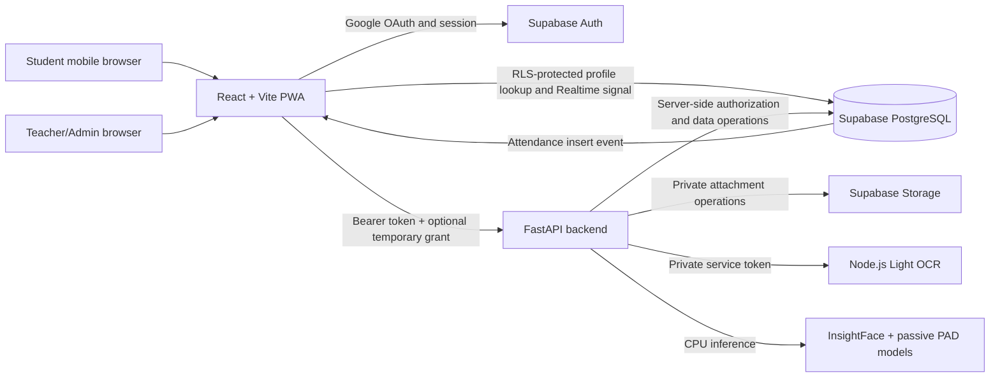

# Project Overview and Improvement Plan

**Project:** AI-assisted student attendance system  
**Review date:** 12 September 2026  
**Review basis:** Current repository source code, Supabase migrations, release scripts, automated tests, deployment documentation, Git status, and read-only Supabase release checks.  
**Important status note:** This document distinguishes between a feature that exists in source code and a feature that is proven ready in the deployed environment. The application has broad functional coverage, but the complete production release is not yet closed because the database migration history must be reconciled, the permanent Mini PC backend must replace the temporary development tunnel, and representative load/security acceptance tests remain outstanding.

## 1. Executive Summary

This project is a web-based attendance platform for KMUTNB students, teachers, and administrators. It combines:

- Google OAuth authentication restricted to the KMUTNB email domain.
- Course and roster management.
- Dynamic QR attendance authorization.
- Student-card OCR through a private Node.js Light OCR service.
- Active liveness detection and face recognition.
- Teacher-operated NFC attendance.
- Manual and bulk attendance correction.
- Live check-in notifications.
- Attendance history, statistics, and report exports.
- Student course-join requests and support conversations with private attachments.
- A controlled Teacher-to-Temporary-Admin elevation workflow.
- Supabase as the managed Backend-as-a-Service for Auth, PostgreSQL, Storage, and Realtime.

The application is designed as a hybrid deployment:

- The React frontend can be hosted on Vercel or another static web host.
- The FastAPI backend and Light OCR service run on an Ubuntu Server Mini PC.
- Supabase hosts identity, relational data, private file storage, and Realtime events.

The project currently targets the following operating systems for development and operation:

- Windows 10/11 through `start_all.bat` and `setup_windows.bat`.
- Ubuntu, Linux Mint, and Fedora through `start_all.sh`.
- Ubuntu Server 24.04 LTS for the Mini PC deployment through the Docker/release workflow.

## 2. System Architecture

### 2.1 Frontend

The frontend is implemented with React 19, TypeScript, Vite, Tailwind CSS, and PWA support.

Its responsibilities are:

- Render separate student, teacher, and administrator experiences.
- Maintain the Supabase browser session and send the access token to the backend.
- Keep the student interface mobile-oriented, with a fixed navigation bar and a scrollable content area.
- Keep teacher and administrator pages responsive across desktop and smaller screens.
- Scan Dynamic QR codes and control the camera-based liveness interaction.
- Preload and cache the self-hosted MediaPipe face-landmarker model and WASM assets.
- Resize/compress student-card images before upload while preserving OCR readability.
- Display live attendance updates, histories, reports, settings, and support threads.
- Keep the temporary-admin grant in memory rather than persistent browser storage.

Sensitive business decisions are not trusted to the browser. The backend rechecks the user, role, course ownership, enrollment, attendance session, QR challenge, liveness evidence, OCR result, and face match.

### 2.2 FastAPI Backend

The backend is the security and business-logic boundary. It:

- Validates each Supabase access token and loads the current database role.
- Enforces KMUTNB-domain access on the server.
- Enforces student ownership, teacher course ownership, permanent-admin-only actions, and temporary-admin restrictions.
- Issues and consumes short-lived, user-bound, course-bound, session-bound attendance challenges.
- Validates uploaded image type, dimensions, pixel count, and byte size.
- Coordinates OCR, liveness/PAD, InsightFace embedding extraction, and face comparison.
- Calculates `present`, `late`, or `absent` from course thresholds.
- Performs roster, course, support, report, NFC, and audit operations.
- Exposes liveness/readiness health endpoints for deployment monitoring.
- Applies CORS, trusted-host, request-size, security-header, no-store, and request-ID controls.

### 2.3 Light OCR Service

The OCR component is a private Node.js sidecar and is not intended to be called by a browser.

It:

- Uses Light OCR rather than the removed EasyOCR implementation.
- Reads a 13-digit student identifier from a student-card image.
- Requires a private backend-to-OCR token in production.
- Has a bounded queue, request deadline, input-memory limit, and image-size limit.
- Omits raw OCR text by default because OCR output may contain personal data.
- Runs on CPU so that the target Mini PC does not require a discrete GPU.

### 2.4 Face and Liveness Pipeline

The active workflow is:

1. Place exactly one face within the guide frame.
2. Move closer to the camera and return to the frame.
3. Perform a server-selected one- or two-blink challenge.
4. Capture selected evidence frames: baseline, near, return, closed-eye, open-eye, and final face.
5. Recompute movement, bilateral blinking, face continuity, passive PAD, and identity on the backend.
6. Compare the final embedding with the registered embedding using InsightFace.
7. Store the attendance record only when the complete chain passes.

The browser does **not** stream or permanently upload a complete video. It sends selected compressed frames and signed evidence. Raw attendance photos are not kept permanently. The design raises the difficulty of printed-photo and prerecorded-video attacks, but an RGB-camera-only implementation must not be described as impossible to spoof or as independently certified presentation-attack detection.

### 2.5 Supabase

Supabase provides:

- **Auth:** Google OAuth identities and browser sessions.
- **PostgreSQL:** profiles, courses, enrollments, sessions, attendance, challenges, requests, temporary-admin state, and audit logs.
- **Storage:** the private `student-request-files` bucket.
- **Realtime:** attendance-record events used to refresh the teacher live feed.
- **RLS and grants:** browser-visible tables are protected with Row Level Security; security-critical tables and functions are restricted to backend-controlled paths.
- **RPC functions:** atomic operations for challenge claim/finalization/renewal, roster import, bulk attendance, course-join decisions, and face enrollment.

The backend service key must remain server-side. The frontend uses only the publishable/anonymous client configuration and the signed-in user's session.

## 3. Functional Capabilities

### 3.1 Authentication and Identity

- Google OAuth sign-in.
- KMUTNB email-domain enforcement in both application logic and database provisioning logic.
- Student profile creation from a valid student identity pattern.
- Teacher and permanent-administrator access through an invitation/provisioning flow.
- Server-derived roles; frontend route selection is not an authorization control.
- Google-account avatar display with a restricted trusted host check.
- Clear handling for missing profiles, invalid sessions, and outdated database migrations.

### 3.2 Student Capabilities

- View and edit the student's own profile.
- Set academic year from 1 through 8 and update class-level information supported by the profile schema.
- Display the Google account profile image.
- View registered courses.
- Join a course by submitting its eight-character classroom code.
- View or cancel pending course-join requests.
- Register a face through student-card OCR plus liveness verification when no face is registered.
- Scan a Dynamic QR code and complete card OCR, liveness, and face recognition to check in.
- View personal attendance history and summary statistics.
- See face-registration and NFC-registration states.
- Receive guidance to contact a teacher when NFC is not registered.
- Open support/request threads, send messages, attach images or PDFs, and preview authorized attachments.

### 3.3 Teacher Capabilities

- Create, update, and delete courses owned by that teacher.
- Open a course settings hub and return to the course view.
- Configure total sessions, late threshold, absent threshold, and maximum absence percentage.
- Generate, display, rotate, enable, or disable a classroom join code.
- Review and approve/reject student course-join requests.
- Add or remove individual roster members.
- Preview and import `.xlsx` or `.csv` rosters with validation and protected atomic commit behavior.
- Provision pending students so that course membership is linked when the invited user first signs in.
- Start, rotate, and close an attendance session.
- Display a Dynamic QR code that changes every 10–15 seconds according to backend configuration.
- Operate NFC attendance for enrolled students with registered UIDs.
- View successful face/OCR and NFC check-ins in the live feed.
- Add manual attendance and perform authorized bulk attendance changes.
- Export attendance reports in CSV, Excel, and PDF formats.
- Reply to support requests within the teacher's authorized scope.
- Request temporary administrator enrollment.

Teacher course actions are limited by backend ownership checks. A teacher cannot gain access to another teacher's course merely by modifying frontend state or a URL.

### 3.4 Temporary Administrator Capabilities

A temporary administrator is still a teacher at the permanent identity level. The effective administrator role is granted only after this sequence:

1. The teacher submits a one-time request.
2. A permanent administrator approves it.
3. The teacher creates and confirms a six-digit PIN.
4. On later use, the teacher enters the PIN to receive a short-lived grant.
5. The grant is bound to the teacher and the current Supabase authentication session.
6. Repeated failed PIN attempts trigger lockout controls.
7. Deactivation, logout, expiry, or administrator revocation invalidates access.

While active, the teacher can use selected administrator screens and non-permanent administrator operations. Important restrictions enforced by the backend include:

- Cannot change any user's role.
- Cannot create a permanent administrator invitation.
- Cannot edit a permanent administrator account.
- Cannot delete users.
- Cannot delete courses through permanent-admin endpoints.
- Cannot replace a student's face embedding through the administrator enrollment path.
- Cannot approve or revoke temporary-administrator enrollment; those actions require a permanent administrator.

The temporary grant does not silently transfer ownership of another teacher's courses. Endpoints that require course ownership continue to enforce it.

### 3.5 Permanent Administrator Capabilities

- View and manage users and pending invitations.
- Create student, teacher, or administrator invitations.
- Change permanent roles.
- Edit user identity/profile fields.
- Delete users, except the currently active administrator's own account.
- View all courses and perform permanent-administrator course deletion.
- Register or replace face information under supervised administrative control.
- Register and manage student NFC UIDs.
- View system-wide reports and audit logs.
- Review, approve, reject, and revoke temporary-administrator requests/enrollments.
- Access global system overview and administrative settings.

Permanent administrator operations remain high-impact. They must be protected by stronger authentication, comprehensive audit coverage, and operational review before production.

### 3.6 Internal Service Identities

- **FastAPI backend:** holds server-only Supabase credentials and performs privileged database/storage operations after application authorization.
- **Light OCR service:** accepts only private server-to-server requests carrying the configured OCR token.
- **Supabase database functions:** use controlled execution privileges for atomic operations and must keep explicit `search_path`, execute grants, and RLS behavior.

These identities are not human roles and must never be exposed in frontend environment variables, browser bundles, screenshots, or documentation containing real values.

## 4. Attendance Rules and Data Lifecycle

- Supported attendance methods are face plus OCR, NFC, and authorized manual entry.
- Face attendance requires a valid Dynamic QR challenge. A missing, expired, reused, wrong-user, wrong-course, or wrong-session challenge is rejected.
- Attendance challenges are single-use and protected by atomic claim/finalize operations.
- Course settings determine the late and absent thresholds.
- Successful check-in returns the recorded server time and updates the teacher view.
- Duplicate attendance is rejected at both application and database levels where applicable.
- Check-out is intentionally not supported.
- Permanent storage of raw attendance photographs is intentionally not supported.
- Face embeddings are retained as biometric templates and therefore still require strict privacy, retention, deletion, access, and incident-response rules.

## 5. Existing Security and Reliability Controls

The repository already contains substantial controls:

- Server-side access-token validation and current-role lookup.
- KMUTNB-domain restriction.
- Role and object-ownership dependencies.
- Permanent-admin guards for irreversible/high-risk operations.
- Session-bound, expiring temporary-admin grants stored as hashes.
- PIN hashing, attempt counting, lockout, revocation, and audit events.
- Dynamic, expiring, single-use QR challenges.
- Signed liveness evidence with server-side frame verification.
- Passive PAD checks and face-continuity checks.
- Backend-only OCR and bounded OCR workload.
- Image magic-byte/type checks, decompression-bomb limits, dimensions, pixels, and byte limits.
- Spreadsheet type/size/row/column/cell/ZIP expansion limits.
- Private support storage and authorization before attachment download.
- RLS and explicit browser-access restrictions in Supabase migrations.
- Exact production CORS allowlists rather than wildcard credentialed CORS.
- Trusted-host, security-header, API no-store, request-size, and rate-limit controls.
- Health/readiness endpoints, Docker resource limits, release verification, atomic install, and rollback scripts.
- Security-focused backend, frontend, and OCR automated tests.

These controls reduce risk but do not replace deployment verification, penetration testing, privacy governance, backups, monitoring, or real-device biometric validation.

## 6. Current Verification Snapshot

### 6.1 Repository State

- Branch: `main`.
- Local branch status at review time: two commits ahead of `origin/main`.
- Worktree was clean before this documentation task.
- The two local-only commits are documentation/runbook-related and must be reviewed and pushed intentionally.

### 6.2 Supabase Read-Only Release Check

The current release check reported:

- Database lint: no schema errors.
- Performance Advisor: no reported issues at the time of review.
- Security Advisor: leaked-password protection is disabled.
- Migration history: not fully synchronized.

The following local/remote timestamp pairs represent corresponding logical migrations but are not recorded with the same timestamp:

- Local `20260902065653` versus remote `20260902071442`.
- Local `20260902072732` versus remote `20260902073016`.
- Local `20260902150753` versus remote `20260902150954`.

In addition, local migration `20260907164433_secure_face_enrollment_liveness.sql` was not present remotely at review time.

This mismatch is a release blocker. It can make secure self-service face enrollment fail even when the frontend and backend code are correct. Do not rename, apply, or repair migration history blindly. First compare the SQL content and remote schema, decide which timestamps are canonical, back up the database, and rehearse the repair on staging.

### 6.3 Deployment State

- The frontend has been promoted through a Vercel-oriented workflow.
- Recent operational records describe the backend as running from the development workstation through a temporary tunnel.
- This is useful for staging/mobile acceptance testing but is not a durable production backend.
- The intended production backend is the always-on Ubuntu Server Mini PC behind a stable HTTPS API domain.

### 6.4 Test Coverage State

Existing automated coverage includes authorization regressions, bulk-attendance security, course-join security, face-enrollment security, image security, launcher security, liveness frames and tokens, operational security, roster-import security, general security, support security, temporary-admin security, spreadsheet security, face-runtime checks, API-origin checks, OCR security, OCR smoke testing, and OCR concurrency testing.

The largest remaining quality gaps are full browser end-to-end coverage, a database actor/RLS matrix, migration CI against a clean Supabase project, real-device biometric acceptance tests, and representative 30–40-user load/soak testing on the target Mini PC.

## 7. Required Improvements

### 7.1 Priority 0 — Release Blockers

#### P0-1. Reconcile and Apply Supabase Migrations

**Problem:** Local and remote migration history differ, and the secure face-enrollment migration is missing remotely.

**Action:**

1. Create a database backup.
2. Compare each mismatched local SQL file with the live remote objects/functions.
3. Rehearse `supabase migration repair` or the chosen canonical migration procedure against staging.
4. Apply the secure face-enrollment migration to staging.
5. Run the full enrollment and attendance acceptance flow.
6. Promote exactly the verified migration set to production.
7. Re-run migration list, database lint, Security Advisor, Performance Advisor, and the role/RLS matrix.

**Exit criteria:** Local and remote histories match; enrollment and attendance RPCs exist with expected grants; all role tests pass.

#### P0-2. Replace the Temporary Backend Tunnel

**Problem:** A workstation/tunnel backend depends on a developer session and is unsuitable for production availability.

**Action:** Install the signed/reviewed release on the Ubuntu Server 24.04 Mini PC, use an API-only Docker profile, configure a stable DNS name and trusted TLS termination, start services automatically after reboot, and test rollback.

**Exit criteria:** The API survives reboot, tunnel closure, service restart, and release rollback without changing the frontend URL.

#### P0-3. Prove Capacity for 30–40 Concurrent Users

**Problem:** Unit and component concurrency tests do not prove end-to-end capacity on an Intel Core i3-7100T with 8 GB RAM.

**Action:** Run staged load tests for login/profile reads, QR challenge issuance, 30–40 nearly simultaneous face/OCR submissions, NFC bursts, live-feed updates, and report reads. Include a one- to two-hour soak test. Measure p50/p95/p99 latency, failure rate, OCR queue depth, CPU, RAM, swap, disk, network upload, Supabase request rate, and recovery after overload.

**Exit criteria:** The team defines and meets an explicit service objective. A practical starting target is no lost/duplicate attendance, less than 1% server errors excluding intentional overload responses, and a documented p95 check-in time under the accepted user limit.

#### P0-4. Calibrate Liveness and Face Recognition on Real Devices

**Problem:** Straight-ahead blink detection has been reported as intermittent, while excessive relaxation would weaken spoof protection.

**Action:** Build a labeled acceptance set covering iPhone front/rear cameras, Iriun Cam, laptop webcams, glasses, multiple skin tones, backlight, indoor light, modest movement, and controlled photo/video replay attacks. Tune tracker and backend thresholds from false-reject and false-accept evidence rather than one global anecdotal value.

**Exit criteria:** Genuine-user success and attack-rejection targets are documented, repeatable, and versioned; users receive actionable retry guidance; backend PAD remains mandatory.

#### P0-5. Close Authentication Hardening

**Problem:** Supabase reports leaked-password protection disabled, and permanent administrators do not yet have a documented AAL2/MFA requirement.

**Action:**

- If Google OAuth is the only supported method, disable unused password authentication paths.
- If passwords remain enabled, turn on leaked-password protection and define password policy.
- Require MFA/AAL2 for permanent administrators and for destructive operations.
- Define session maximum lifetime, inactivity timeout, and reauthentication rules appropriate to the institution.
- Test role changes, admin revocation, session revocation, and grant expiry from already-open browser tabs.

**Exit criteria:** No unused login method remains; admin MFA and session policy are enforced and tested.

#### P0-6. Establish Backup, Restore, and Privacy Governance

**Problem:** Production readiness requires evidence that attendance, support, and biometric data can be recovered and lawfully managed.

**Action:** Define backup frequency, point-in-time recovery expectations, encrypted off-system configuration backup, quarterly restore drills, retention periods, deletion procedures, authorized staff, breach response, consent/notice, and biometric-data handling under applicable institutional policy and Thai PDPA requirements.

**Exit criteria:** A successful restore drill and an approved data-retention/privacy runbook are recorded without placing personal data in repository logs.

### 7.2 Priority 1 — Performance and Scalability

#### P1-1. Paginate Large Collections

The administrator user/course/log views, support threads, course rosters, and long attendance lists should use server-side pagination, filtering, and stable ordering. Avoid loading every row into the browser. Add total-count endpoints only where the UI needs them.

#### P1-2. Reduce Live-Feed Refetching

The current Realtime insert signal triggers a backend refresh, with polling as a fallback. For larger sessions:

- Append a validated enriched event or request only the changed row.
- Reconcile periodically rather than refetching the full feed on every insert.
- Subscribe to relevant updates as well as inserts if manual status edits must appear live.
- Pause polling when the browser tab is hidden and use exponential backoff during errors.

#### P1-3. Replace Support-Center Polling

The support UI currently uses interval refresh behavior. Use authorization-safe Realtime updates or conditional requests with ETags/updated timestamps, visibility-aware polling, pagination, and backoff.

#### P1-4. Reduce Authentication and Database Round Trips

Every backend request currently validates the token through Supabase Auth and then queries the profile. This favors role freshness but adds latency. Benchmark it first. If it is material:

- Verify asymmetric Supabase JWTs locally from cached JWKS for normal endpoints.
- Keep short-lived role/profile caching with explicit invalidation on role changes or revocation.
- Continue online/session-fresh verification for destructive permanent-admin actions.
- Never authorize from stale JWT custom claims alone when a role has just changed.

#### P1-5. Consolidate Multi-Query Workflows

Profile lookups, NFC check-in, overviews, and course-management screens can make several sequential Supabase REST calls. Replace high-frequency sequences with narrow SQL/RPC operations or joined queries where this reduces latency without broadening privileges. Keep transactions for changes that must succeed or fail together.

#### P1-6. Move Large Report Generation Off the Browser

Small reports can remain client-generated. Large course-wide or institution-wide exports should be generated as bounded backend jobs, streamed or stored temporarily, and downloaded through a short-lived authorized URL. Add row limits, cancellation, expiry, and audit records.

#### P1-7. Protect CPU-Heavy Inference

- Prewarm InsightFace, passive PAD, Light OCR, and browser face-landmarker assets before the attendance window.
- Keep one backend process per loaded model set on the 8 GB Mini PC unless measurement proves more workers are safe.
- Preserve bounded face/PAD semaphores and the OCR queue.
- Return a clear `429` or `503` with `Retry-After` when capacity is full rather than exhausting RAM.
- Separate lightweight API traffic from inference queues so health, QR, and NFC remain responsive.
- Consider a local job queue only if direct bounded execution fails the measured workload; avoid unnecessary distributed complexity for one Mini PC.

#### P1-8. Add Operational Observability

Record structured, privacy-safe metrics for endpoint latency, status codes, request IDs, OCR duration, face/PAD duration, queue utilization, QR challenge failures, database duration, CPU, RAM, disk, and process restarts. Use `pg_stat_statements` and Supabase query tooling to find real slow queries. Add alerts for readiness failure, queue saturation, disk pressure, repeated auth failures, and backup failure.

#### P1-9. Optimize Frontend Delivery with Measurement

The project already lazy-loads heavy reporting libraries and face assets. Continue with:

- Bundle-size budgets and CI reporting.
- Core Web Vitals on representative iPhones and Android devices.
- Immutable caching for hashed assets.
- Route-level prefetch only for likely next actions.
- React query caching/deduplication for profiles and course lists with correct invalidation.
- Avoiding camera/model reinitialization across harmless UI transitions.

### 7.3 Priority 2 — Security, Privacy, and Fraud Resistance

#### P2-1. Add a Database Actor/RLS Test Matrix

Automate positive and negative tests for anonymous, student A, student B, teacher owner, non-owner teacher, temporary administrator, permanent administrator, and backend service identity. Cover every exposed table, storage bucket, RPC function, and Realtime subscription.

#### P2-2. Make Privileged Audit Logging Dependable

Some administrative audit writes currently log an error and allow the primary change to succeed. Classify operations:

- High-risk role/deletion/biometric changes should use a transaction, database trigger, or durable outbox so an audit record cannot be silently lost.
- Low-risk events may remain best-effort if documented.
- Audit pages need pagination, integrity/retention controls, and restricted export.
- Logs must never contain raw PINs, tokens, biometric images/embeddings, student-card images, or attachment contents.

#### P2-3. Harden NFC Against UID Cloning

An NFC UID is an identifier, not strong proof of possession. For higher assurance, register trusted reader devices, sign reader requests with a device credential and nonce, rotate/revoke reader keys, rate-limit UIDs, flag impossible rapid reuse, and consider a second factor for sensitive scenarios.

#### P2-4. Validate Biometric Risk Quantitatively

Measure face threshold false-accept/false-reject rates and liveness attack presentation rates on the actual device population. Record model versions and threshold changes. Do not market the system as certified PAD unless an independent certification actually exists.

#### P2-5. Review Data Minimization

- Confirm whether administrator lists need the full NFC UID; prefer masked display.
- Define face-embedding deletion when a student leaves.
- Expire abandoned challenges and temporary files automatically.
- Define support attachment retention and secure deletion.
- Keep OCR raw text disabled in production.
- Confirm that database backups and diagnostic exports follow the same data controls.

#### P2-6. Harden the Mini PC

Use automatic security updates with a maintenance policy, firewall default-deny rules, SSH keys, disabled password/root SSH login, least-privilege service accounts, read-only model mounts, log rotation, encrypted secrets outside Git, TLS renewal monitoring, UPS protection, time synchronization, and a documented patch/rollback window.

### 7.4 Priority 3 — Quality and Maintainability

#### P3-1. Add Browser End-to-End Tests

Use a staging Supabase project and non-personal fixtures to test sign-in routing, role boundaries, student profile/course join, roster import, session creation, QR challenge, simulated inference outcomes, NFC, live feed, support attachments, temporary-admin lifecycle, reports, and logout/revocation.

#### P3-2. Add Migration CI

For every change, build a clean temporary database, apply all migrations in order, run database tests/advisors, compare generated types/schema, and then run backend integration tests. Reject timestamp collisions and remote-only migration drift before deployment.

#### P3-3. Improve API Consistency

Adopt consistent response/error envelopes, pagination metadata, retry hints, and typed frontend clients. Remove stale comments and ensure Thai user messages remain clear while operational logs use structured English event names.

#### P3-4. Improve Accessibility and Device Coverage

Test keyboard navigation, visible focus, labels, screen readers, contrast, reduced motion, large text, safe-area insets, landscape mode, iOS Safari, Android Chrome, and unstable mobile networks. Ensure the fixed student navigation never obscures content or camera controls.

#### P3-5. Formalize Configuration Ownership

Document which values are security policy and which are deployment tuning. Validate environment values at startup, expose only non-sensitive effective values to authorized settings screens, and version threshold changes with test evidence. Configuration should not be silently duplicated between frontend and backend.

#### P3-6. Keep Dependencies and Models Reproducible

Pin dependencies, preserve lockfiles, verify model checksums/licenses, scan containers and npm/Python packages, produce a software bill of materials, and test offline model preparation. Upgrade one risk domain at a time with rollback capability.

## 8. Recommended Delivery Order

1. Back up Supabase and reconcile migration history in staging.
2. Apply and verify secure face enrollment in staging.
3. Close unused-password/MFA/session policy and run the full role/RLS matrix.
4. Calibrate liveness and face thresholds on real devices with labeled evidence.
5. Deploy the backend/OCR release to the Mini PC behind stable HTTPS.
6. Add observability and verify backup restore and rollback.
7. Run 30–40-user burst and soak tests on the real hardware/network.
8. Fix measured bottlenecks: pagination, live-feed deltas, reduced round trips, inference queues, or report jobs.
9. Run full mobile/browser/accessibility and operational acceptance tests.
10. Freeze the release, record checksums and configuration, promote it, and monitor closely during the first live attendance sessions.

## 9. Suggested Production Acceptance Checklist

- [ ] Local and remote Supabase migration histories match.
- [ ] Supabase database lint, Security Advisor, and Performance Advisor have no unaccepted findings.
- [ ] Anonymous/student/teacher/temp-admin/permanent-admin RLS and API negative tests pass.
- [ ] Password provider is disabled if unused, or leaked-password protection is enabled.
- [ ] Permanent administrators use MFA/AAL2 and tested session policy.
- [ ] Dynamic QR expiration, reuse, wrong-user, wrong-course, and wrong-session tests pass.
- [ ] Face enrollment and attendance liveness tests pass on the target device matrix.
- [ ] Controlled printed-photo and prerecorded-video attacks are rejected at the agreed rate.
- [ ] NFC reader/device controls and cloning risk are accepted or improved.
- [ ] 30–40-user burst and soak tests meet the agreed service objective.
- [ ] Backend/OCR survive Mini PC reboot and resume automatically.
- [ ] Stable HTTPS, DNS, CORS, OAuth redirect URLs, trusted hosts, and certificate renewal are verified.
- [ ] Backup restore, release rollback, and incident contacts are rehearsed.
- [ ] Logs/metrics contain no secrets, raw biometrics, card images, or student records beyond approved identifiers.
- [ ] Privacy notice, biometric consent/legal basis, retention, access, and deletion procedures are approved.
- [ ] Local commits intended for production are reviewed and pushed; build artifacts are produced from a known commit.

## 10. Known Scope Decisions

The following are deliberate product decisions, not unfinished bugs:

- There is no attendance check-out workflow.
- Raw attendance photos are not stored permanently.
- Face attendance requires a Dynamic QR challenge rather than location/geofence validation.
- NFC registration is supervised by teaching/administrative staff rather than self-service.
- The student experience is optimized for phone browsers; teacher and administrator experiences remain responsive for broader screen sizes.

## 11. Key Project References

- Thai user guide: [`USER_GUIDE_TH.md`](./USER_GUIDE_TH.md)
- Ubuntu deployment guide: [`DEPLOYMENT_GUIDE_TH.md`](./DEPLOYMENT_GUIDE_TH.md)
- Hybrid Vercel/Mini PC deployment guide: [`HYBRID_VERCEL_MINIPC_DEPLOYMENT_TH.md`](./HYBRID_VERCEL_MINIPC_DEPLOYMENT_TH.md)
- Deployment runbook: [`../deployment/README.md`](../deployment/README.md)
- Design context: [`../DESIGN.md`](../DESIGN.md)
- Liveness research plan: [`../LIVENESS_BLINK_RESEARCH_PLAN.md`](../LIVENESS_BLINK_RESEARCH_PLAN.md)
- Work history and handoff record: [`../log.md`](../log.md)

Current Supabase guidance used when evaluating the remaining work:

- [Production Checklist](https://supabase.com/docs/guides/deployment/going-into-prod)
- [Auth Sessions](https://supabase.com/docs/guides/auth/sessions)
- [JSON Web Tokens and signing keys](https://supabase.com/docs/guides/auth/jwts)
- [Multi-Factor Authentication](https://supabase.com/docs/guides/auth/auth-mfa)
- [Database Advisors](https://supabase.com/docs/guides/database/database-advisors)

## 12. Final Assessment

The source code represents a capable, security-conscious attendance application rather than an early prototype. The major business workflows—identity, courses, rosters, Dynamic QR, OCR, liveness, face recognition, NFC, attendance, reports, support requests, and temporary administration—are implemented.

However, “implemented” is not yet equivalent to “production-proven.” The most important next work is not adding more screens. It is closing database drift, deploying the durable Mini PC backend, strengthening administrator authentication, validating biometrics with evidence, proving 30–40-user capacity, and establishing monitoring, backup/restore, privacy, and end-to-end release controls. Once those acceptance gates pass, the project can be promoted with substantially lower operational and security risk.
